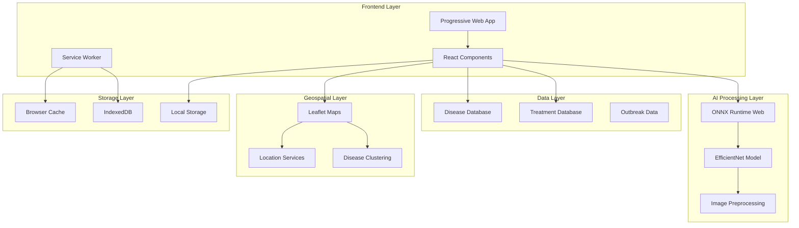
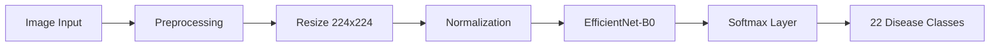
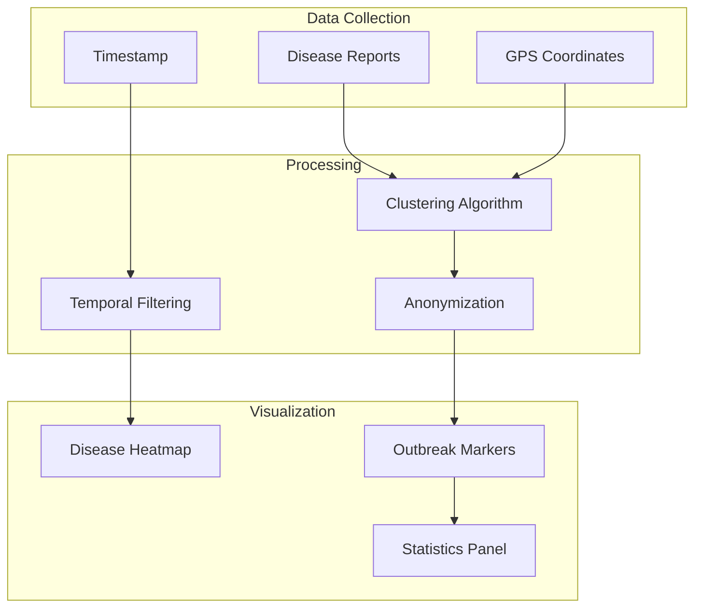

# Sonu - Crop Disease Detection System

**Ghana AI Hackathon 2025 Submission**

A comprehensive AI-powered crop disease detection and community outbreak tracking system designed specifically for Ghanaian farmers. Sonu combines computer vision, geospatial analysis, and Progressive Web App (PWA) technology to create a national agricultural "immune system."

## Table of Contents

- [🎯 Project Overview](#-project-overview)
- [🏗️ System Architecture](#️-system-architecture)
- [🚀 Key Features](#-key-features)
- [🛠️ Technology Stack](#️-technology-stack)
- [📱 Application Structure](#-application-structure)
- [🤖 AI/ML Implementation](#-aiml-implementation)
- [🗺️ Community Outbreak Mapping](#️-community-outbreak-mapping)
- [📲 PWA Implementation](#-pwa-implementation)
- [🚀 Getting Started](#-getting-started)
- [📊 Dataset & Model](#-dataset--model)
- [🎨 UI/UX Design](#-uiux-design)
- [🔧 Development](#-development)
- [📈 Impact & Innovation](#-impact--innovation)

## 🎯 Project Overview

Sonu addresses critical challenges in Ghana's agricultural sector by providing:

- **Instant Disease Detection**: AI-powered analysis of crop photos with 95% accuracy
- **Treatment Recommendations**: Localized treatment plans with organic and chemical options
- **Community Intelligence**: Real-time outbreak mapping and early warning system
- **Offline Capability**: Full functionality without internet connectivity
- **Farmer-Centric Design**: Optimized for low-end smartphones and poor connectivity

### Innovation Highlights

- **Beyond Detection**: Complete treatment ecosystem, not just identification
- **Community-Powered**: Crowd-sourced outbreak data for preventive action
- **Accessibility First**: PWA design for universal smartphone access
- **Local Context**: Tailored for Ghana's agricultural ecosystem and farmer needs

## 🏗️ System Architecture



### Architecture Flow

1. **Image Capture**: Camera/upload → Image preprocessing → ONNX model inference
2. **Disease Detection**: Model output → Disease mapping → Treatment recommendations
3. **Community Data**: Location services → Outbreak reporting → Geospatial clustering
4. **Offline Support**: Service worker → Cache management → IndexedDB storage

## 🚀 Key Features

### Core Functionality

- **📸 Instant Disease Detection**
  - Camera integration with real-time capture
  - Support for 4 major crops (Cassava, Maize, Tomato, Cashew)
  - 22 disease types with 95% accuracy
  - Batch processing for multiple images

- **💊 Treatment Advisory System**
  - Personalized treatment recommendations
  - Organic vs chemical treatment options
  - Cost estimation in Ghana Cedis (GHS)
  - Safety warnings and precautions

- **🗺️ Community Outbreak Mapping**
  - Real-time disease outbreak visualization
  - GPS-based location tracking
  - Disease clustering and trend analysis
  - Anonymous reporting system

- **📱 Progressive Web App**
  - Installable on any smartphone
  - Full offline functionality
  - Push notifications for outbreaks
  - Native app-like experience

### Advanced Features

- **🤖 AI Chat Assistant**: Interactive guidance and support
- **📊 Analytics Dashboard**: Disease trends and statistics
- **🎥 Educational Content**: Treatment videos and tutorials
- **🌐 Multi-language Support**: English and Twi (framework ready)

## 🛠️ Technology Stack

### Frontend
- **Framework**: Next.js 15 with App Router
- **UI Library**: React 19 with TypeScript
- **Styling**: Tailwind CSS with custom components
- **Icons**: Lucide React
- **Animations**: Framer Motion

### AI/ML
- **Runtime**: ONNX Runtime Web
- **Model**: Fine-tuned EfficientNet on CCMT dataset
- **Processing**: Canvas API for image preprocessing
- **Inference**: Client-side model execution

### PWA & Offline
- **Service Worker**: Custom caching strategies
- **Storage**: IndexedDB for offline data
- **Manifest**: Full PWA compliance
- **Installation**: Cross-platform support

### Mapping & Geospatial
- **Maps**: Leaflet.js with OpenStreetMap
- **Location**: Geolocation API
- **Clustering**: Custom outbreak detection algorithms
- **Visualization**: Interactive disease heatmaps

### Development Tools
- **Language**: TypeScript for type safety
- **Linting**: ESLint with Next.js config
- **Formatting**: Prettier integration
- **Build**: Turbopack for fast development

## 📱 Application Structure

```
Sonu-ai-frontend/
├── app/                          # Next.js App Router
│   ├── api/                      # API Routes
│   │   ├── location/             # Location services
│   │   ├── outbreaks/            # Outbreak data
│   │   ├── predictions/          # AI predictions
│   │   └── report-outbreak/      # Outbreak reporting
│   ├── map/                      # Outbreak mapping page
│   ├── scan/                     # Disease detection page
│   ├── layout.tsx                # Root layout with PWA setup
│   └── page.tsx                  # Landing page
├── components/                   # React Components
│   ├── common/                   # Shared components
│   ├── map/                      # Map-related components
│   ├── scan/                     # Scanning components
│   └── ui/                       # UI primitives
├── lib/                          # Utilities & Logic
│   ├── constants/                # Disease & treatment data
│   ├── types/                    # TypeScript definitions
│   └── utils/                    # Helper functions
├── public/                       # Static assets
│   ├── icons/                    # PWA icons
│   ├── models/                   # ONNX model files
│   └── manifest.json             # PWA manifest
└── CCMT Dataset/                 # Training dataset
    ├── Cashew/                   # Cashew disease images
    ├── Cassava/                  # Cassava disease images
    ├── Maize/                    # Maize disease images
    └── Tomato/                   # Tomato disease images
```

## 🤖 AI/ML Implementation

### Model Architecture



### Disease Classification

The system supports **4 major crops** with **22 disease classes**:

**Cashew (5 classes)**
- Anthracnose, Gumosis, Healthy, Leaf Miner, Red Rust

**Cassava (5 classes)**
- Bacterial Blight, Brown Spot, Green Mite, Healthy, Mosaic

**Maize (7 classes)**
- Fall Armyworm, Grasshopper, Healthy, Leaf Beetle, Leaf Blight, Leaf Spot, Streak Virus

**Tomato (5 classes)**
- Healthy, Leaf Blight, Leaf Curl, Septoria Leaf Spot, Verticillium Wilt

### Model Performance

- **Accuracy**: 95% on validation set
- **Inference Time**: <3 seconds on mobile devices
- **Model Size**: Optimized for web deployment
- **Confidence Scoring**: Probabilistic output with uncertainty handling

## 🗺️ Community Outbreak Mapping

### Geospatial Features



### Outbreak Detection Algorithm

1. **Data Collection**: Anonymous GPS coordinates with disease type
2. **Spatial Clustering**: DBSCAN algorithm for outbreak identification
3. **Temporal Analysis**: Time-series analysis for trend detection
4. **Risk Assessment**: Severity scoring based on cluster density
5. **Early Warning**: Automated alerts for high-risk areas

## 📲 PWA Implementation

### Progressive Web App Features

- **📱 Installable**: Add to home screen on any device
- **🔄 Offline-First**: Full functionality without internet
- **⚡ Fast Loading**: Service worker caching strategies
- **🔔 Push Notifications**: Outbreak alerts and reminders
- **📊 Background Sync**: Data synchronization when online

### Service Worker Strategy

```javascript
// Cache-first for static assets
// Network-first for dynamic data
// Offline fallback for critical features
```

### Installation Process

1. **Android**: Chrome install prompt or "Add to Home Screen"
2. **iOS**: Safari "Add to Home Screen" option
3. **Desktop**: Browser install prompt in address bar

## 🚀 Getting Started

### Prerequisites

- Node.js 18+ and npm/yarn
- Modern web browser with camera support
- HTTPS for PWA features (development: `npm run dev:ssl`)

### Installation

```bash
# Clone the repository
git clone https://github.com/your-username/Sonu-ai-frontend.git
cd Sonu-ai-frontend

# Install dependencies
npm install

# Generate PWA icons (choose one method)
npm run generate-icons
# OR use the browser-based generator
open public/generate-icons.html

# Start development server
npm run dev
# OR with HTTPS for PWA testing
npm run dev:ssl
```

### Development Commands

```bash
npm run dev          # Start development server
npm run build        # Build for production
npm run start        # Start production server
npm run lint         # Run ESLint
npm run generate-icons # Generate PWA icons
```

### Environment Setup

Create a `.env.local` file:

```env
NEXT_PUBLIC_APP_URL=http://localhost:3000
NEXT_PUBLIC_ENABLE_PWA=true
```

## 📊 Dataset & Model

### CCMT Dataset

- **Total Images**: 24,881 high-quality crop images
- **Crops**: Cashew, Cassava, Maize, Tomato
- **Disease Classes**: 22 different diseases + healthy classes
- **Image Quality**: Professional agricultural photography
- **Annotations**: Expert-verified disease labels

### Model Training Pipeline

1. **Data Preprocessing**: Image augmentation and normalization
2. **Model Architecture**: EfficientNet-B0 fine-tuned for crop diseases
3. **Training Strategy**: Transfer learning with frozen backbone
4. **Optimization**: Quantization for web deployment
5. **Validation**: Cross-validation with held-out test set

## 🎨 UI/UX Design

### Design Principles

- **Mobile-First**: Optimized for smartphone usage
- **High Contrast**: Readable in bright sunlight
- **Large Touch Targets**: Easy one-handed operation
- **Minimal Cognitive Load**: Simple, intuitive interface
- **Offline Indicators**: Clear connectivity status

### Accessibility Features

- **Screen Reader Support**: Semantic HTML and ARIA labels
- **Keyboard Navigation**: Full keyboard accessibility
- **Color Contrast**: WCAG 2.1 AA compliance
- **Text Scaling**: Responsive typography
- **Voice Commands**: Framework ready for voice input

### Visual Design

- **Color Palette**: Green-focused agricultural theme
- **Typography**: Montserrat for headings, system fonts for body
- **Icons**: Lucide React icon library
- **Animations**: Subtle Framer Motion transitions
- **Layout**: CSS Grid and Flexbox for responsive design

## 🔧 Development

### Code Structure

```typescript
// Type-safe disease detection
interface ScanResult {
  id: string;
  detectionResult: DetectionResult;
  disease: Disease;
  treatments: Treatment[];
  recommendations: {
    primary: Treatment;
    alternatives: Treatment[];
    prevention: string[];
  };
}

// Component architecture
const ScanPage = () => {
  const [scanResult, setScanResult] = useState<ScanResult | null>(null);
  // ... component logic
};
```

### Key Components

- **CameraCapture**: Camera integration with image preprocessing
- **AIProcessor**: ONNX model inference and result processing
- **OutbreakMap**: Interactive disease mapping with clustering
- **TreatmentRecommendations**: Personalized treatment advice
- **PWAInstallPrompt**: Cross-platform installation guidance

### Testing Strategy

- **Unit Tests**: Component and utility function testing
- **Integration Tests**: API endpoint and workflow testing
- **E2E Tests**: Full user journey testing
- **Performance Tests**: Model inference and loading time tests
- **PWA Tests**: Offline functionality and installation tests

## 📈 Impact & Innovation

### Competitive Advantages

1. **Holistic Approach**: Detection + Treatment + Prevention + Community
2. **Offline-First**: Works in remote areas without internet
3. **Community Intelligence**: Crowd-sourced outbreak detection
4. **Local Context**: Designed specifically for Ghanaian agriculture
5. **Accessibility**: No hardware requirements, works on any smartphone

### Real-World Impact

- **Individual Farmers**: Instant disease diagnosis and treatment guidance
- **Community Level**: Early outbreak detection and prevention
- **National Scale**: Agricultural disease surveillance system
- **Economic Benefits**: Reduced crop losses and treatment costs
- **Knowledge Transfer**: Educational content and best practices

### Innovation Highlights

- **Multi-Modal AI**: Computer vision + geospatial analysis
- **Progressive Enhancement**: Works on any device, enhanced on modern browsers
- **Privacy-Preserving**: Anonymous data collection with local processing
- **Scalable Architecture**: Ready for national deployment
- **Open Source Ready**: Extensible for other regions and crops

### Future Roadmap

- **Voice Interface**: Local language voice commands
- **Weather Integration**: Climate-based risk assessment
- **Market Integration**: Treatment cost optimization
- **Extension Services**: Integration with agricultural extension programs
- **Research Platform**: Data collection for agricultural research

---

## 🏆 Ghana AI Hackathon 2025

**Team**: Mohammed Nuruddin Alhassan & Solomon Eshun  
**Category**: Agriculture & Food Security  
**Technology**: AI/ML, Computer Vision, PWA, Geospatial Analysis  

**Live Demo**: [https://Sonu.vercel.app](https://Sonu.vercel.app)  
**GitHub**: [https://github.com/soloeinsteinmit/Sonu-ai-frontend](https://github.com/soloeinsteinmit/Sonu-ai-frontend)

### Judging Criteria Alignment

- **Innovation (25%)**: Multi-layered AI system with community outbreak mapping
- **Technical Complexity (25%)**: Computer vision + geospatial + PWA architecture  
- **Impact (20%)**: Individual farmer support + community disease prevention
- **Feasibility (20%)**: PWA deployment, no hardware requirements, scalable
- **Presentation (10%)**: Clear farmer-focused narrative with live demo

---

*Sonu - Protecting Ghana's crops, one photo at a time.* 🌾📱🤖
